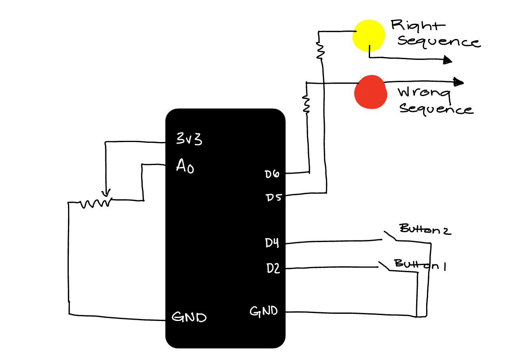

# HW11: Finite State Machine
 
I wanted my finite state machine to consist of 3 steps for successful opening of my "lock". The firdst step is to press button 2, then to turn the potentiometer all the way to the right, then to press button 1. I wanted all of this to initially be done within 5 seconds. Unfortunately, I ran into some issues. I thought that time could be the problem, so I extended the check to 10 seconds and increased the delay from 50 to 100. However, although the code did not have any errors after being checked byu the Arduino software, it still would not appear on my board. I am not sure if this is due to a connection issue or not, but everything appeared to be setup correctly.

Below is an image of what the real-world application of my finite state machine would look like as a lockpad.

This is a schematic of how I aimed to prepare my circuit board setup. 
